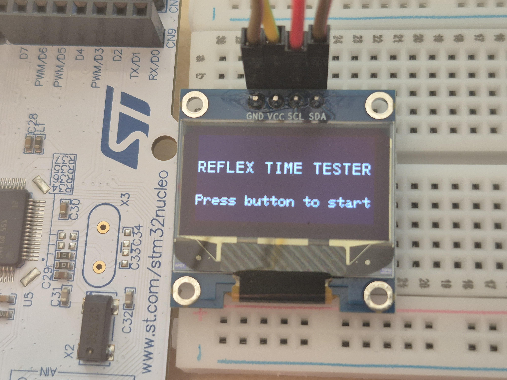

# Reflex Timer — STM32F446RE

Embedded reaction time measurer on STM32 Nucleo F446RE.
Measures reaction time between a visual signal and a button press.
Displays current, best and average reaction time on an OLED display.

## Hardware
- STM32 Nucleo F446RE
- SSD1306 OLED 128x64

## Concepts
- Hardware timers (TIM10)
- GPIO interrupts (EXTI)
- I2C communication (OLED)

## Third party
- SSD1306 library by Aleksander Alekseev (MIT): https://github.com/afiskon/stm32-ssd1306/blob/master/LICENSE
- ST HAL drivers (ST License)

## SHOWCASE VIDEO 

